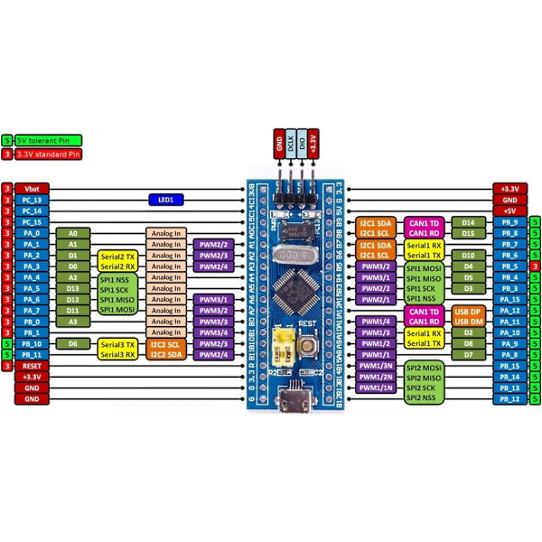

# STM32 з нуля без HAL

Bare-metal програмування STM32F103 з нуля — без CubeMX, без ST HAL, тільки регістри і розуміння.

**Платформа:** Blue Pill (STM32F103C8T6) · ST-Link v2 · Linux · arm-none-eabi-gcc

**Серія статей на DOU:** [STM32 з нуля без HAL](https://dou.ua/users/aleksandr-petroff)

---

## Blue Pill — розпіновка



---

## Структура репо

```
├── example_base/          ← голі bare-metal приклади
│   ├── BLINK_stm32/       ← перше мигання, 272 байти
│   ├── GPIO_stm32/        ← кілька портів, BSRR vs ODR
│   ├── RUNNING_FIRE_stm32/← біжучий вогонь по пінах
│   ├── UART_stm32/        ← hardware UART
│   ├── BUTTON_EXTI_stm32/ ← EXTI переривання, кнопка PA1 → LED PC13
│   ├── UART_RX_IRQ/       ← UART RX через переривання + ring buffer
│   ├── SYS_TICK_BLINK/    ← SysTick переривання, non-blocking delay
│   ├── TIM2_BLINK/        ← TIM2 переривання
│   ├── TIM2_PWM_BLINK/    ← PWM дихання LED на PA0
│   ├── SPI_NOKIA5110/     ← SPI + Nokia 5110 дисплей
│   ├── I2C_MPU6050/       ← I2C + акселерометр MPU6050
│   └── OLED_PULSE/        ← ADC + пульс сенсор + OLED дисплей
│
├── HAL_stm32/             ← свій мінімальний HAL
│   ├── hal/
│   │   ├── hal.h/.c           ← головний include + hal_init()
│   │   ├── hal_gpio.h/.c      ← GPIO: init, write, read, toggle
│   │   ├── hal_systick.h/.c   ← SysTick: delay_ms, get_ticks
│   │   ├── hal_uart.h/.c      ← UART: puts, printf, gets
│   │   ├── hal_exti.h/.c      ← EXTI переривання
│   │   ├── hal_tim.h/.c       ← TIM2 IRQ + PWM
│   │   ├── hal_spi.h/.c       ← SPI1
│   │   ├── hal_i2c.h/.c       ← I2C1
│   │   └── hal_adc.h/.c       ← ADC1
│   └── src/
│       ├── startup.c      ← повна таблиця векторів (Table 63 RM0008)
│       └── main.c
│
├── docs/                  ← конспекти і шпаргалки
├── INDEX.md               ← індекс всіх конспектів
└── README.md
```

---

## Швидкий старт

```bash
# клонуємо
git clone https://github.com/pipicosim800-maker/stm32F103
cd stm32F103

# перший приклад — мигання
cd example_base/BLINK_stm32
make && make flash
```

**Потрібно встановити:**
```bash
sudo apt install gcc-arm-none-eabi binutils-arm-none-eabi stlink-tools
```

Детальна інструкція: [docs/STM32_FirstSteps.md](docs/STM32_FirstSteps.md)

---

## HAL API

### Ініціалізація
```c
#include "hal/hal.h"

hal_init();  // SysTick 8MHz HSI
```

### GPIO
```c
gpio_init(PIN_PC13, OUTPUT);
gpio_write(PIN_PC13, LOW);   // LOW = LED on (Blue Pill інвертований)
gpio_toggle(PIN_PC13);
uint8_t val = gpio_read(PIN_PA1);
```

### UART
```c
uart_init(9600);
uart_puts("Hello STM32\r\n");
uart_printf("val=%d hex=%x\r\n", 42, 0xDEAD);
```

### EXTI
```c
exti_init(PIN_PA1, EXTI_FALLING);

// в main.c окремо:
void EXTI1_IRQHandler(void) {
    if (EXTI_PR & (1 << 1)) {
        EXTI_PR = (1 << 1);
        gpio_toggle(PIN_PC13);
    }
}
```

### TIM2
```c
// переривання кожні 500мс
tim2_init_irq(500);

void TIM2_IRQHandler(void) {
    if (TIM2_SR & TIM_SR_UIF) {
        TIM2_SR = 0;
        gpio_toggle(PIN_PC13);
    }
}

// PWM на PA0
gpio_init(PIN_PA0, OUTPUT_AF_FAST);
tim2_init_pwm(1000, 999);  // 1кГц, роздільна здатність 0-999
tim2_pwm_set(500);          // 50% duty cycle
```

### SPI
```c
spi1_init();         // PA5=SCK, PA7=MOSI, PA6=MISO
spi1_send(0xFF);
```

### I2C
```c
i2c1_init();         // PB6=SCL, PB7=SDA, 100кГц

i2c1_write(0x68, reg, data);
uint8_t val = i2c1_read(0x68, reg);

uint8_t buf[6];
i2c1_read_buf(0x68, 0x3B, buf, 6);
```

### ADC
```c
adc1_init(1);        // PA1 = канал 1
uint16_t val = adc1_read();  // 0-4095
```

### Час
```c
delay_ms(500);
uint32_t now = get_ticks();  // мс від старту
```

---

## Принцип серії

```
Bare-metal спочатку → розуміємо регістри
Потім HAL           → загортаємо в зручний API
```

Кожен приклад в `example_base/` показує як периферія працює без абстракцій.
HAL — це просто зручна обгортка над тим що вже зрозуміли.

---

## Конспекти і довідники

Детальний індекс: [INDEX.md](INDEX.md)

| Тема | Файл |
|------|------|
| Перший запуск | [docs/STM32_FirstSteps.md](docs/STM32_FirstSteps.md) |
| Довідник регістрів | [docs/STM32F103_dovidnyk.md](docs/STM32F103_dovidnyk.md) |
| EXTI переривання | [docs/EXTI_notes.md](docs/EXTI_notes.md) |
| PWM і таймери | [docs/PWM.md](docs/PWM.md) |
| SPI протокол | [docs/SPI___що_це_таке_фізично.md](docs/SPI___що_це_таке_фізично.md) |
| I2C і MPU6050 | [docs/I2C_MCU6050.md](docs/I2C_MCU6050.md) |

---

## Залізо

- Blue Pill (STM32F103C8T6) — 64KB Flash, 20KB SRAM, 72MHz max
- ST-Link v2
- Nokia 5110 дисплей
- SSD1306 OLED 128x64
- MPU6050 акселерометр/гіроскоп
- Pulse Sensor
- HC-SR04 ультразвук (в планах)

---

*Місяць 1 з 6-місячного роадмапу: від GPIO до Linux Kernel Driver*
*Наступний крок — Місяць 2: STM32 ↔ Linux через UART*
